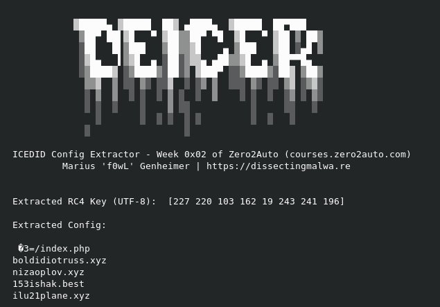

# deICEr

A crude Config Extractor for IcedID second stage Loaders (Zero2Auto Week 0x02)

If you need a sample to test it with check out [this one](https://malshare.com/sample.php?action=detail&hash=5333b6ac993080f860f120dcc1bafad4) on Malshare (already unpacked for your convenience)
